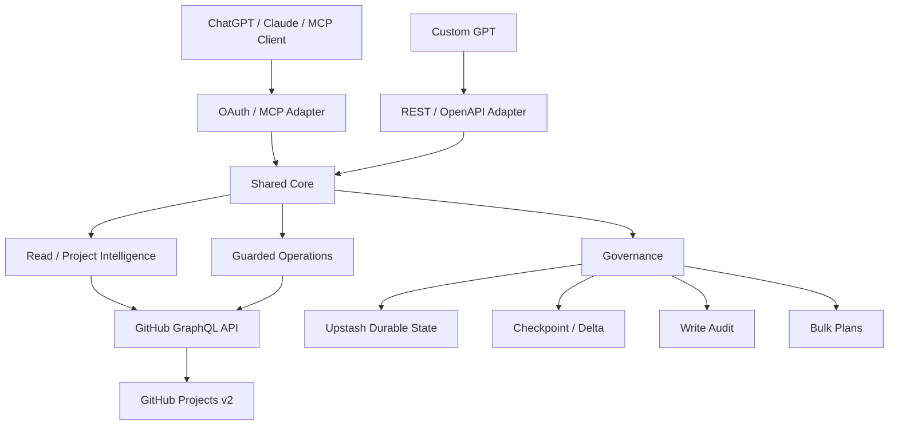
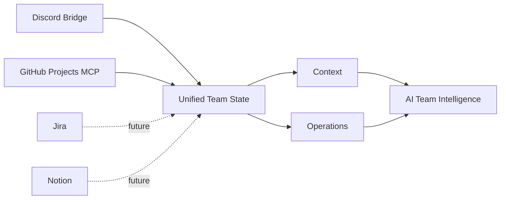

<div align="center">


<br/>

<p>
  
  
  
  
  
</p>

<p>
  
  
  
  
  
</p>

**GitHub Projects → Safe AI Operations → Better Team Execution**  
ChatGPT, Claude 같은 AI 클라이언트가 GitHub Projects v2를 **조회·분석·변경·검증·감사**할 수 있도록 연결하는 production-oriented MCP server입니다.

[⚡ Quick Start](#-quick-start) · [✨ Features](#-features) · [💡 Use Cases](#-use-cases) · [🛡 Safe Operations](#-safe-operations) · [🏗 Architecture](#-architecture) · [📚 Docs](#-docs)

</div>

---

## 👀 At a glance

<table>
<tr>
<td width="33%" valign="top">

### 📊 Understand Project State

Project item, Status, Priority, assignee, relationship, 변경 사항을 읽고 현재 팀 상태를 구조화합니다.

</td>
<td width="33%" valign="top">

### 🛡 Operate Safely

권한과 allowlist, write gate, precondition, re-read verification을 거쳐 안전하게 Project를 변경합니다.

</td>
<td width="33%" valign="top">

### 🧾 Track Changes

Checkpoint / delta와 durable audit를 이용해 변경 전후와 실행 결과를 추적합니다.

</td>
</tr>
</table>

```text
ChatGPT / Claude / other MCP clients
                │
          OAuth / Remote MCP
                ▼
     Gyuniverse GitHub Projects MCP
                │
       ┌────────┼────────┐
       │        │        │
     Read    Safe Write  Governance
       │        │        │
       ├─ State │        ├─ Checkpoint / Delta
       ├─ Gap   ├─ Status / Priority
       ├─ Brief ├─ Item / Assignment
       └─ Relation      ├─ Relationship
                         └─ Bulk Preview → Approval → Apply
                │
                ▼
        GitHub Projects v2
```

> **핵심 목표**  
> GitHub Projects를 단순 API wrapper가 아니라, AI가 실제 팀 운영에 활용할 수 있는 **safe project operations layer**로 만드는 것.

---

## ✨ Features

| Status | 기능 | 설명 |
| :---: | --- | --- |
| ✅ | Project / field / item 조회 | Projects v2 메타데이터와 현재 field 값을 읽음 |
| ✅ | Workflow intelligence | missing Status / assignee, PR merge ↔ Project 상태 불일치 탐지 |
| ✅ | Project brief | normalized snapshot 기반 팀 상태 브리핑 |
| ✅ | Checkpoint / delta | 기준선을 저장하고 이후 변경 사항 비교 |
| ✅ | Guarded Status / Priority | semantic high-level write + post-write verification |
| ✅ | Work item operations | backlog capture, item 생성, assignment 등 high-level workflow 지원 |
| ✅ | Relationship read | parent / sub-issue / blocks / blocked-by 조회 |
| ✅ | Guarded relationship write | admin-only 관계 추가 / 제거 + reciprocal verification |
| ✅ | Bulk governance | immutable Preview → Approval → Apply workflow |
| ✅ | Durable audit | Production에서 Upstash 기반 bounded write audit |
| ✅ | Role-based ACL | Viewer / Member / Admin + capability 기반 runtime authorization |
| ✅ | Remote OAuth MCP | OAuth discovery, DCR, PKCE, read/write scope separation |
| ✅ | GPT Actions adapter | Shared Core 위에 REST/OpenAPI adapter 제공 |

### Intentionally Guarded

이 서버는 AI가 GitHub Projects를 수정할 수 있게 하지만, **tool이 보인다는 이유만으로 write 권한이 생기지 않습니다.**

```text
Tool discovery
    ≠
Authorization
```

실제 mutation은 OAuth scope, identity, Project membership, role/capability, owner/Project allowlist, server write gate와 각 operation의 검증을 모두 통과해야 합니다.

파괴적인 delete 계열 도구는 의도적으로 제공하지 않습니다.

---

## ⚡ Quick Start

### Production Endpoint

```text
https://gyuniverse-github-projects-mcp.vercel.app/mcp
```

GPT Actions OpenAPI:

```text
https://gyuniverse-github-projects-mcp.vercel.app/openapi.json
```

| Client | Connection | Authentication | Server support |
| --- | --- | --- | :---: |
| ChatGPT connector | Remote MCP | OAuth + PKCE | ✅ |
| Custom GPT | GPT Actions / OpenAPI | OAuth | ✅ |
| Claude Code | Remote HTTP MCP | OAuth | ✅ |
| Claude Chat / compatible connector | Remote MCP | OAuth + DCR + PKCE | ✅ |

> 실제 read/write 사용 가능 범위는 연결한 클라이언트의 기능과 발급된 OAuth scope, 서버의 ACL / write gate 설정에 따라 달라집니다.

<details>
<summary><b>🟢 Remote MCP 연결</b></summary>

<br/>

MCP Server URL:

```text
https://gyuniverse-github-projects-mcp.vercel.app/mcp
```

서버는 OAuth protected-resource / authorization-server discovery, public DCR, PKCE S256 흐름을 제공합니다.

기본 scope:

```text
projects:read
```

write가 서버에서 활성화된 경우 사용할 수 있는 추가 scope:

```text
projects:write
```

</details>

<details>
<summary><b>🟢 Custom GPT / GPT Actions 연결</b></summary>

<br/>

OpenAPI schema:

```text
https://gyuniverse-github-projects-mcp.vercel.app/openapi.json
```

GPT Actions용 REST adapter도 MCP와 동일한 Shared Core, authorization, verification, audit 경계를 사용합니다.

</details>

<details>
<summary><b>🛠 Local stdio 개발</b></summary>

<br/>

```bash
git clone https://github.com/4hglee-ops/gyuniverse-github-projects-mcp.git
cd gyuniverse-github-projects-mcp
pnpm install
cp .env.example .env
pnpm mcp:stdio
```

최소 read-only 예시:

```dotenv
GITHUB_TOKEN=github_pat_...
GITHUB_PROJECTS_ALLOWED_OWNERS=4hglee-ops,gyuniverse-hq
GITHUB_PROJECTS_WRITE_ENABLED=false
```

</details>

---

## 💡 Use Cases

### 현재 프로젝트 상태 브리핑

```text
gyuniverse-hq Project #2의 현재 상태를
진행 중 / Review / Blocker / 담당자 없는 작업으로 정리해줘.
```

### Project 상태 이상 탐지

```text
merge된 PR과 GitHub Project Status가 어긋난 항목을 찾아줘.
```

### 변경 추적

```text
Project #2를 checkpoint와 비교해서
Status, Priority, assignee, relationship이 달라진 항목만 보여줘.
```

### Status / Priority 변경

```text
Issue #14의 Priority를 P0로 변경하고 결과를 다시 확인해줘.
```

### Relationship 조회 / 변경

```text
Issue #8과 #9의 parent / sub-issue 및 dependency 관계를 조회해줘.
```

```text
Issue #9를 Issue #8의 sub-issue로 추가한 뒤 reciprocal state를 다시 검증해줘.
```

### Bulk 변경

```text
이 작업들의 Status / Priority 변경안을 먼저 Preview해줘.
아직 GitHub에는 적용하지 마.
```

이후 승인된 plan만 Apply할 수 있습니다.

---

## 🧠 Why this exists

팀이 GitHub Projects를 운영하다 보면 이런 질문이 반복됩니다.

```text
"지금 실제로 진행 중인 작업은 뭐지?"
"PR은 merge됐는데 왜 Project는 아직 In Progress지?"
"이 Issue가 다른 작업을 막고 있나?"
"AI에게 상태 변경을 맡겨도 안전할까?"
"AI가 바꾼 내용을 나중에 확인할 수 있나?"
```

Gyuniverse GitHub Projects MCP는 Project 상태를 AI가 읽기 쉬운 형태로 정규화하고, 변경이 필요한 경우에는 명시적인 안전 경계를 거쳐 실제 GitHub operation을 수행합니다.

```text
Project State
     ↓
Normalized Context
     ↓
AI Analysis
     ↓
Authorization / Precondition
     ↓
GitHub Mutation
     ↓
Re-read Verification
     ↓
Durable Audit
```

---

## 🛡 Safe Operations

### Default role model

| Capability | Admin | Member | Viewer |
| --- | :---: | :---: | :---: |
| Project read / analysis | ✅ | ✅ | ✅ |
| Status / Priority update | ✅ | ✅ | ❌ |
| Existing item add | ✅ | ✅ | ❌ |
| Item create / assign | ✅ | ❌ | ❌ |
| Generic field update | ✅ | ❌ | ❌ |
| Relationship write | ✅ | ❌ | ❌ |
| Bulk preview / approve / apply | ✅ | ❌ | ❌ |

Identity별 permission snapshot은 role default를 **좁힐 수만 있고 확장할 수는 없습니다.**

### Authorization path

```text
OAuth identity + scope
        ↓
Owner allowlist
        ↓
Project allowlist
        ↓
Identity Project membership
        ↓
Operation capability
        ↓
Global write gate
        ↓
Precondition / full preflight
        ↓
GitHub mutation
        ↓
Normalized re-read verification
        ↓
Durable audit
```

### Bulk safety

Bulk operation은 즉시 여러 항목을 수정하지 않습니다.

```text
Preview
   ↓
Approval
   ↓
Apply
```

Preview plan은 digest-bound immutable artifact로 저장되고, Apply 전 current state와 authorization을 다시 검사합니다. stale preflight가 발견되면 mutation 없이 실패합니다.

---

## 🏗 Architecture



### Tech Stack

| Layer | Technology |
| --- | --- |
| Language | TypeScript |
| GitHub API | GraphQL |
| MCP | `@modelcontextprotocol/server`, `@modelcontextprotocol/node` |
| Validation | Zod |
| Runtime | Node.js |
| Package Manager | pnpm |
| Deployment | Vercel |
| Durable Store | Upstash Redis |

상세 구조: [`docs/ARCHITECTURE.md`](docs/ARCHITECTURE.md)

---

## ✅ Current Status

**M10 Advanced Governance — Production validated / complete**

- ✅ Local + Remote MCP foundation
- ✅ OAuth / DCR / PKCE
- ✅ Shared Core + MCP / REST adapters
- ✅ Individual identity + Viewer / Member / Admin ACL
- ✅ High-level Project reads and writes
- ✅ Checkpoint / delta
- ✅ Durable audit
- ✅ Dependency / sub-issue read
- ✅ Guarded relationship write
- ✅ Bulk Preview → Approval → Apply
- ✅ Richer capability-based ACL
- ✅ Production validation / closeout

M10 closeout 기준 full regression suite는 **236 / 236 tests passed**로 기록되어 있습니다.

현재 알려진 제한과 deferred validation은 [`docs/M10_CLOSEOUT.md`](docs/M10_CLOSEOUT.md)를 참고하세요.

---

## 🧪 Validation

일반 개발 검증:

```bash
pnpm install --frozen-lockfile
pnpm typecheck
pnpm build
pnpm test
```

read-only integration smoke:

```bash
pnpm smoke:read -- gyuniverse-hq 2
```

HTTP runtime smoke:

```bash
pnpm smoke:http
```

CI는 PR / `main` push에서 typecheck, build, test를 수행하며 secret이나 Production mutation을 요구하지 않습니다.

---

## 📚 Docs

| Document | Purpose |
| --- | --- |
| [`docs/ARCHITECTURE.md`](docs/ARCHITECTURE.md) | 전체 architecture / layer 설명 |
| [`docs/ARCHITECTURE_V2.md`](docs/ARCHITECTURE_V2.md) | Shared Core 중심 구조 정리 |
| [`docs/DEPLOYMENT_RUNTIME.md`](docs/DEPLOYMENT_RUNTIME.md) | Vercel / runtime 구성 |
| [`docs/SECURITY.md`](docs/SECURITY.md) | 보안 원칙 |
| [`docs/SECURITY_PERMISSIONS.md`](docs/SECURITY_PERMISSIONS.md) | permission / role 기준 |
| [`docs/M9_REST_GPT_ACTIONS.md`](docs/M9_REST_GPT_ACTIONS.md) | REST / GPT Actions adapter |
| [`docs/M10_ADVANCED_GOVERNANCE.md`](docs/M10_ADVANCED_GOVERNANCE.md) | M10 governance 전체 설계 |
| [`docs/M10_RELATIONSHIP_WRITES.md`](docs/M10_RELATIONSHIP_WRITES.md) | relationship write 안전 모델 |
| [`docs/M10_BULK_PLANS.md`](docs/M10_BULK_PLANS.md) | Bulk Preview / Approval / Apply |
| [`docs/M10_RICHER_ACL.md`](docs/M10_RICHER_ACL.md) | capability-based ACL |
| ⭐ [`docs/M10_CLOSEOUT.md`](docs/M10_CLOSEOUT.md) | Production validation / M10 closeout |
| [`docs/ROADMAP.md`](docs/ROADMAP.md) | milestone / roadmap |

---

## 🔐 Security

절대로 commit하지 않습니다.

```text
- GitHub PAT / token
- OAuth signing secret
- OAuth team / access codes
- GPT Actions client secret
- Upstash credentials
- bearer / refresh tokens
- .env files
```

주요 원칙:

- GitHub credential은 server-side에만 유지
- client-facing OAuth token과 GitHub credential을 분리
- least privilege + explicit allowlist
- write는 runtime authorization과 verification을 반드시 통과
- destructive delete tool 미제공
- Production durable state에는 credential snapshot을 저장하지 않음

---

## 🛠 Local Development

Requirements:

- Node.js 22+
- pnpm 10.x
- target Projects에 접근 가능한 GitHub credential

```bash
git clone https://github.com/4hglee-ops/gyuniverse-github-projects-mcp.git
cd gyuniverse-github-projects-mcp
pnpm install
cp .env.example .env
```

```bash
pnpm typecheck
pnpm build
pnpm test
pnpm mcp:stdio
```

Remote HTTP 개발:

```bash
pnpm mcp:http
```

---

## 🗺 Roadmap



**Current**  
`GitHub Projects → Read / Analyze / Safe Write / Verify / Audit`

**Next possibility**  
Higher-level workflow intelligence, operator UX, cross-source reconciliation

**Long-term direction**  
Discord의 **대화 맥락(Context)** 과 GitHub Projects의 **운영 상태(Operations)** 를 함께 사용해 “팀에서 무엇이 결정됐고, 현재 무엇이 진행 중이며, 무엇을 바꿔야 하는가?”를 Evidence와 함께 다루는 **Gyuniverse Team Intelligence**.

---

## License

No license is currently granted. This repository is private during the initial development phase.

---

<div align="center">


### 🌌 Gyuniverse

**Project state → Safe operations → Better team execution**

<sub>Built for AI-native GitHub Projects workflows.</sub>

</div>
