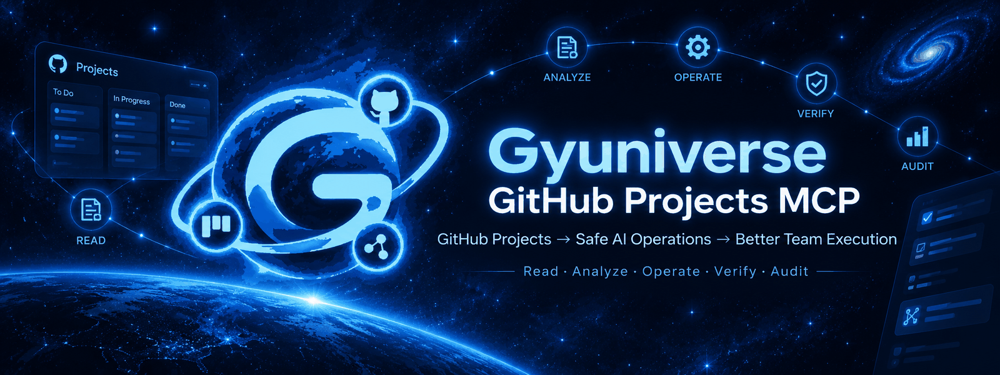
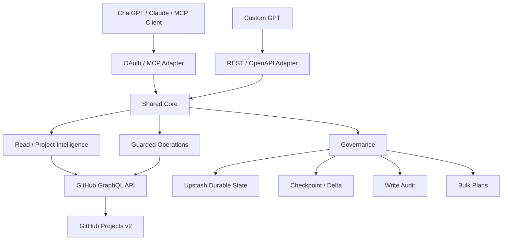
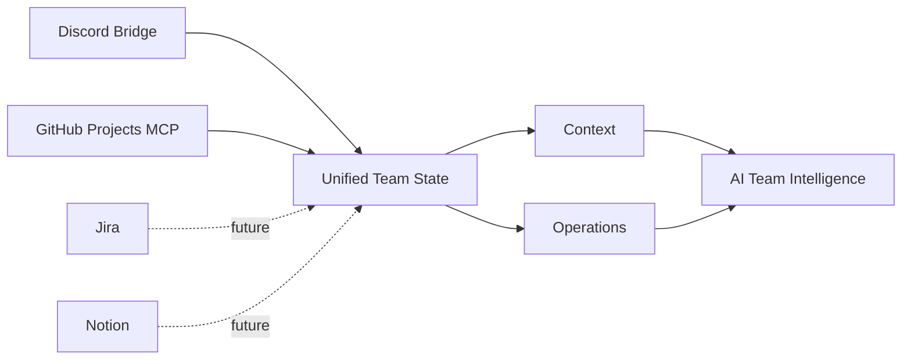

<div align="center">



<br/>

<p>
  
  
  
  
  
</p>

<p>
  
  
  
  
  
</p>

**GitHub Projects → Safe AI Operations → Better Team Execution**

ChatGPT, Claude 같은 AI 클라이언트가 GitHub Projects v2를 **조회·분석·변경·검증·감사**할 수 있도록 연결하는 MCP 서버입니다.

[빠른 시작](#-빠른-시작) · [주요 기능](#-주요-기능) · [안전한-변경](#-안전한-변경) · [아키텍처](#-아키텍처) · [문서](#-문서)

</div>

---

## 👀 한눈에 보기

<table>
<tr>
<td width="33%" valign="top">

### 📊 Project 상태 이해

Project item, Status, Priority, assignee, relationship과 변경 사항을 읽어 현재 팀 상태를 구조화합니다.

</td>
<td width="33%" valign="top">

### 🛡 안전한 변경

권한, allowlist, write gate, precondition, 재조회 검증(re-read verification)을 거쳐 실제 Project를 변경합니다.

</td>
<td width="33%" valign="top">

### 🧾 변경 추적

Checkpoint / delta와 durable audit를 이용해 변경 전후와 실행 결과를 추적합니다.

</td>
</tr>
</table>

```text
ChatGPT / Claude / MCP Client
              │
        OAuth / Remote MCP
              ▼
   Gyuniverse GitHub Projects MCP
              │
      ┌───────┼─────────┐
      │       │         │
    Read    Write   Governance
      │       │         │
      │       │         ├─ Checkpoint / Delta
      │       │         ├─ Durable Audit
      │       │         └─ Bulk Plan
      │       │
      └───────┴──────────────► GitHub Projects v2
```

> 핵심 목표는 GitHub Projects를 단순 API wrapper로 만드는 것이 아니라, **AI가 실제 팀 운영 상태를 안전하게 읽고 변경할 수 있는 project operations layer**를 만드는 것입니다.

---

## 🎯 이런 경우에 적합합니다

- ChatGPT / Claude에서 GitHub Projects 상태를 자연어로 조회하고 싶은 경우
- AI에게 Status / Priority 변경을 맡기되 권한과 검증 경계가 필요한 경우
- PR merge 상태와 Project Status의 불일치를 탐지하고 싶은 경우
- parent / sub-issue / dependency 관계를 AI workflow에서 다루고 싶은 경우
- 여러 변경을 즉시 실행하지 않고 Preview → Approval → Apply 방식으로 통제하고 싶은 경우
- AI가 수행한 mutation과 변경 전후 상태를 audit 가능한 형태로 남기고 싶은 경우

---

## ✨ 주요 기능

| 상태 | 기능 | 설명 |
| :---: | --- | --- |
| ✅ | Project / field / item 조회 | Projects v2 메타데이터와 현재 field 값 조회 |
| ✅ | Workflow intelligence | missing Status / assignee, PR merge ↔ Project 상태 불일치 탐지 |
| ✅ | Project brief | normalized snapshot 기반 팀 상태 브리핑 |
| ✅ | Checkpoint / delta | 기준선을 저장하고 이후 변경 사항 비교 |
| ✅ | Guarded Status / Priority | 고수준 write + 변경 후 재조회 검증 |
| ✅ | Work item operations | item 추가, 생성, assignment 등 workflow 지원 |
| ✅ | Relationship read | parent / sub-issue / blocks / blocked-by 조회 |
| ✅ | Guarded relationship write | Admin 관계 추가·제거 + reciprocal verification |
| ✅ | Bulk governance | immutable Preview → Approval → Apply |
| ✅ | Durable audit | Upstash 기반 bounded write audit |
| ✅ | Role-based ACL | Viewer / Member / Admin + capability 기반 runtime authorization |
| ✅ | Remote OAuth MCP | OAuth discovery, DCR, PKCE, read/write scope 분리 |
| ✅ | GPT Actions adapter | Shared Core 위의 REST/OpenAPI adapter |

### 의도적으로 제한한 부분

AI client에서 tool이 보인다는 사실과 실제 실행 권한은 별개입니다.

```text
Tool discovery
    ≠
Authorization
```

파괴적인 delete 계열 도구도 기본 surface에 제공하지 않습니다.

---

## ⚡ 빠른 시작

### Maintainer-hosted endpoint

```text
https://gyuniverse-github-projects-mcp.vercel.app/mcp
```

GPT Actions OpenAPI:

```text
https://gyuniverse-github-projects-mcp.vercel.app/openapi.json
```

> **Publicly reachable ≠ publicly authorized**  
> Endpoint가 인터넷에서 접근 가능하다는 것은 임의의 GitHub Project에 접근할 수 있다는 뜻이 아닙니다.

실제 접근은 OAuth identity, owner/Project allowlist, Project membership, capability와 write gate로 제한됩니다.

자신의 GitHub Projects를 연결하려는 외부 사용자는 일반적으로 **self-hosting**을 권장합니다.

| Client | 연결 방식 | 인증 | 지원 |
| --- | --- | --- | :---: |
| ChatGPT connector | Remote MCP | OAuth + PKCE | ✅ |
| Custom GPT | GPT Actions / OpenAPI | OAuth | ✅ |
| Claude Code | Remote HTTP MCP | OAuth | ✅ |
| Claude Chat / compatible connector | Remote MCP | OAuth + DCR + PKCE | ✅ |

### Local stdio

```bash
git clone https://github.com/4hglee-ops/gyuniverse-github-projects-mcp.git
cd gyuniverse-github-projects-mcp
pnpm install
cp .env.example .env
pnpm mcp:stdio
```

최소 read-only 예시:

```dotenv
GITHUB_TOKEN=github_pat_...
GITHUB_PROJECTS_ALLOWED_OWNERS=your-user-or-org
GITHUB_PROJECTS_WRITE_ENABLED=false
MCP_OAUTH_WRITE_ENABLED=false
```

전체 환경변수는 [`.env.example`](.env.example), 배포 방법은 [`docs/DEPLOYMENT.md`](docs/DEPLOYMENT.md)를 참고하세요.

---

## 💡 활용 예시

### 현재 Project 상태 브리핑

```text
gyuniverse-hq Project #2의 현재 상태를
진행 중 / Review / Blocker / 담당자 없는 작업으로 정리해줘.
```

### 상태 불일치 탐지

```text
merge된 PR과 GitHub Project Status가 어긋난 항목을 찾아줘.
```

### 변경 추적

```text
Project #2를 checkpoint와 비교해서
Status, Priority, assignee, relationship이 달라진 항목만 보여줘.
```

### Status / Priority 변경

```text
Issue #14의 Priority를 P0로 변경하고 결과를 다시 확인해줘.
```

### Relationship

```text
Issue #8과 #9의 parent / sub-issue 및 dependency 관계를 조회해줘.
```

```text
Issue #9를 Issue #8의 sub-issue로 추가한 뒤 reciprocal state를 다시 검증해줘.
```

### Bulk 변경

```text
이 작업들의 Status / Priority 변경안을 먼저 Preview해줘.
아직 GitHub에는 적용하지 마.
```

승인된 plan만 Apply할 수 있습니다.

---

## 🧠 왜 만들었나

팀이 GitHub Projects를 운영하다 보면 이런 질문이 반복됩니다.

```text
"지금 실제로 진행 중인 작업은 뭐지?"
"PR은 merge됐는데 왜 Project는 아직 In Progress지?"
"이 Issue가 다른 작업을 막고 있나?"
"AI에게 상태 변경을 맡겨도 안전할까?"
"AI가 바꾼 내용을 나중에 확인할 수 있나?"
```

이 프로젝트는 Project 상태를 AI가 다루기 쉬운 형태로 정규화하고, 변경이 필요하면 명시적인 안전 경계를 거쳐 GitHub operation을 수행합니다.

```text
Project State
     ↓
Normalized Context
     ↓
AI Analysis
     ↓
Authorization / Precondition
     ↓
GitHub Mutation
     ↓
Re-read Verification
     ↓
Durable Audit
```

---

## 🛡 안전한 변경

### 기본 역할

| Capability | Admin | Member | Viewer |
| --- | :---: | :---: | :---: |
| Project read / analysis | ✅ | ✅ | ✅ |
| Status / Priority update | ✅ | ✅ | ❌ |
| Existing item add | ✅ | ✅ | ❌ |
| Item create / assign | ✅ | ❌ | ❌ |
| Generic field update | ✅ | ❌ | ❌ |
| Relationship write | ✅ | ❌ | ❌ |
| Bulk preview / approve / apply | ✅ | ❌ | ❌ |

Identity별 permission은 role default보다 **좁힐 수만 있고 확장할 수 없습니다.**

### Authorization path

```text
OAuth identity + scope
        ↓
Owner allowlist
        ↓
Project allowlist
        ↓
Identity Project membership
        ↓
Operation capability
        ↓
Global write gate
        ↓
Precondition / preflight
        ↓
GitHub mutation
        ↓
Re-read verification
        ↓
Durable audit
```

### Bulk safety

```text
Preview
   ↓
Approval
   ↓
Apply
```

Apply 직전 current state와 authorization을 다시 확인하며, stale preflight가 발견되면 mutation 없이 실패합니다.

상세 내용은 [`docs/SECURITY.md`](docs/SECURITY.md)와 [`docs/PERMISSIONS.md`](docs/PERMISSIONS.md)를 참고하세요.

---

## 🏗 아키텍처



| 영역 | 기술 |
| --- | --- |
| Language | TypeScript |
| GitHub API | GraphQL |
| MCP | `@modelcontextprotocol/server`, `@modelcontextprotocol/node` |
| Validation | Zod |
| Runtime | Node.js |
| Package Manager | pnpm |
| Deployment | Vercel |
| Durable Store | Upstash Redis |

자세한 구조는 [`docs/ARCHITECTURE.md`](docs/ARCHITECTURE.md)를 참고하세요.

---

## ✅ 현재 상태

**v0.2.0 / M10 Advanced Governance — Production validated**

- ✅ Local + Remote MCP
- ✅ OAuth / DCR / PKCE
- ✅ Shared Core + MCP / REST adapters
- ✅ Individual identity + Viewer / Member / Admin ACL
- ✅ High-level Project reads and writes
- ✅ Checkpoint / delta
- ✅ Durable audit
- ✅ Dependency / sub-issue read
- ✅ Guarded relationship write
- ✅ Bulk Preview → Approval → Apply
- ✅ Capability-based ACL
- ✅ Production validation

현재 공개 저장소 기준 regression suite는 **249 / 249 tests PASS**입니다.

---

## 🧪 검증

```bash
pnpm install --frozen-lockfile
pnpm typecheck
pnpm build
pnpm test
```

Read-only integration smoke:

```bash
pnpm smoke:read -- gyuniverse-hq 2
```

HTTP runtime smoke:

```bash
pnpm smoke:http
```

CI는 PR / `main` push에서 typecheck, build, test를 수행하며 Production mutation을 요구하지 않습니다.

Public 전환 전 sanitized history를 대상으로 별도의 full-history Gitleaks 검사에서도 **0 findings**를 확인했습니다.

---

## 📚 문서

처음 보는 경우 [`docs/README.md`](docs/README.md)부터 읽는 것을 권장합니다.

| 문서 | 내용 |
| --- | --- |
| [`docs/ARCHITECTURE.md`](docs/ARCHITECTURE.md) | 전체 architecture / 요청·권한·변경 흐름 |
| [`docs/SECURITY.md`](docs/SECURITY.md) | 보안 원칙과 authorization boundary |
| [`docs/PERMISSIONS.md`](docs/PERMISSIONS.md) | Viewer / Member / Admin 및 capability 기준 |
| [`docs/DEPLOYMENT.md`](docs/DEPLOYMENT.md) | Vercel / Upstash / self-hosting |
| [`docs/ROADMAP.md`](docs/ROADMAP.md) | 현재 구현과 다음 확장 방향 |
| [`docs/history/README.md`](docs/history/README.md) | M4 → M10 개발·검증 과정 한국어 요약 |
| [`CHANGELOG.md`](CHANGELOG.md) | 공개 버전 변경 이력 |

과거 milestone 상세 원문은 `docs/history/legacy/`에 보존합니다.

---

## 🔐 Security

절대로 commit하지 않습니다.

```text
- GitHub PAT / token
- OAuth signing secret
- OAuth team / access codes
- GPT Actions client secret
- Upstash credentials
- bearer / refresh tokens
- cookies / Authorization headers
- .env files
```

취약점을 발견한 경우 실제 credential이나 private Project data를 public issue에 올리지 마세요.

---

## 🛠 로컬 개발

요구 사항:

- Node.js 22+
- pnpm 10.x
- target Projects에 접근 가능한 GitHub credential

```bash
git clone https://github.com/4hglee-ops/gyuniverse-github-projects-mcp.git
cd gyuniverse-github-projects-mcp
pnpm install
cp .env.example .env
pnpm typecheck
pnpm build
pnpm test
pnpm mcp:stdio
```

Remote HTTP:

```bash
pnpm mcp:http
```

---

## 🤝 기여

Bug report, 문서 개선, 기능 제안, Pull Request를 환영합니다.

개발 환경과 validation 기준은 [`CONTRIBUTING.md`](CONTRIBUTING.md)를 참고하세요.

Public issue/PR에 실제 token, access code, secret, private Project data를 포함하지 마세요.

---

## 🗺 장기 방향



현재는:

`GitHub Projects → Read / Analyze / Safe Write / Verify / Audit`

장기적으로는 Discord의 대화 맥락(Context)과 GitHub Projects의 운영 상태(Operations)를 함께 사용해 **팀에서 무엇이 결정됐고, 현재 무엇이 진행 중이며, 어디가 어긋나 있는지**를 근거와 함께 다루는 방향을 탐색합니다.

---

## License

Apache License 2.0으로 공개합니다. 자세한 내용은 [`LICENSE`](LICENSE)를 참고하세요.

---

<div align="center">


### 🌌 Gyuniverse

**Project state → Safe operations → Better team execution**

</div>
