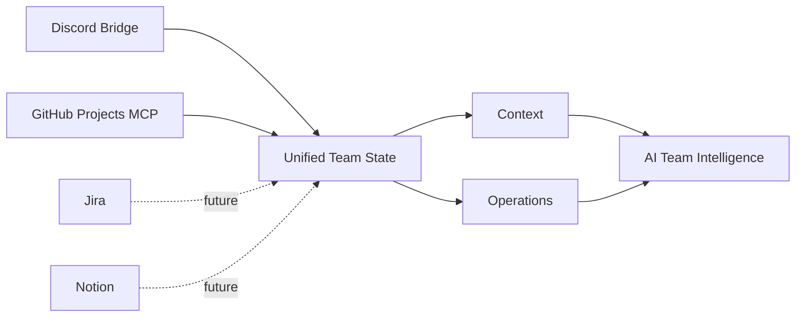

# 로드맵

## 현재 위치

현재 공개 버전은 **v0.2.0 / M10 Advanced Governance**를 기준으로 합니다.

핵심 흐름은 다음까지 구현되어 있습니다.

```text
GitHub Projects
      ↓
Read / Normalize
      ↓
Analyze
      ↓
Authorize
      ↓
Safe Write
      ↓
Re-read Verify
      ↓
Audit / Governance
```

현재 regression suite는 **249 / 249 tests PASS**입니다.

## 완료된 기반

### 1. GitHub Projects 읽기

- Project / field / item 조회
- snapshot 정규화
- Issue / PR → Project item resolve
- assignee / Status / Priority 분석
- state gap 탐지
- reconciliation 분석

### 2. Safe Write

- Status 변경
- Priority 변경
- Project item 추가
- work item 생성 / assignment
- generic field update
- no-op detection
- mutation 후 re-read verification

### 3. Remote MCP / OAuth

- Remote HTTP MCP
- OAuth discovery
- DCR
- PKCE S256
- read/write scope 분리
- ChatGPT / Claude 계열 client 연결

### 4. Identity / ACL

- 개별 OAuth identity
- Viewer / Member / Admin
- capability 기반 runtime authorization
- Project membership
- identity별 permission 축소

### 5. Governance

- durable checkpoint
- checkpoint delta 비교
- durable write audit
- relationship read/write
- bulk Preview → Approval → Apply
- stale preflight
- optional maker-checker

### 6. Adapter 확장

- MCP adapter
- REST / OpenAPI adapter
- GPT Actions 연결
- Shared Core 기반 동일 authorization 경계

## 다음 단계 후보

다음 항목은 하나의 확정된 순서라기보다 확장 가능한 방향입니다.

### A. Operator UX

현재는 AI client가 tool을 호출하는 구조가 중심입니다. 앞으로는 운영자가 다음을 더 쉽게 볼 수 있는 interface를 추가할 수 있습니다.

- 최근 변경 내역
- 실패한 mutation
- audit 검색
- pending bulk plan
- capability / membership 상태
- Project health dashboard

### B. Workflow Intelligence

단순 조회를 넘어 팀 운영 상태를 더 적극적으로 분석할 수 있습니다.

예:

- 오래 멈춘 item 탐지
- PR merge 후 Project status 미갱신 탐지
- assignee 없는 중요 작업 탐지
- blocker chain 분석
- sprint / iteration drift 탐지
- 작업량 편중 분석

### C. Cross-source Reconciliation

장기적으로 GitHub Projects만 보지 않고 다른 협업 source와 함께 팀 상태를 해석하는 방향입니다.



목표는 다음 질문에 근거와 함께 답하는 것입니다.

> 팀에서 무엇이 결정됐고, 지금 무엇이 진행 중이며, 실제 운영 상태와 대화 맥락이 어디서 어긋나고 있는가?

### D. Governance 고도화

필요에 따라 다음을 확장할 수 있습니다.

- audit retention 정책
- 외부 SIEM / observability 연동
- 더 세분화된 capability
- approval policy 다양화
- 조직별 policy preset
- change preview UX

### E. Self-hosting 경험 개선

외부 사용자가 자신의 GitHub Projects에 쉽게 연결할 수 있도록 다음을 개선할 수 있습니다.

- 배포 템플릿
- 설정 검증 CLI
- 초기 read-only setup wizard
- identity / capability 설정 도구
- health diagnostics
- 문서 예제 확대

## 하지 않으려는 것

현재 프로젝트는 다음 방향을 우선하지 않습니다.

- GitHub 전체 API 재구현
- repository code review 기능 복제
- 무제한 autonomous mutation
- destructive delete 중심 자동화
- authorization을 AI prompt에만 의존하는 구조

이 프로젝트의 핵심은 **GitHub Projects를 AI가 사용할 수 있게 하는 것**보다, **AI가 실제 팀 운영 상태를 다룰 때 안전하게 읽고, 판단하고, 변경하고, 검증할 수 있는 경계**를 만드는 데 있습니다.

## 개발 이력

M4 → M7 → M9 → M10으로 이어진 설계·검증 과정은 [`history/README.md`](history/README.md)에 정리되어 있습니다.
